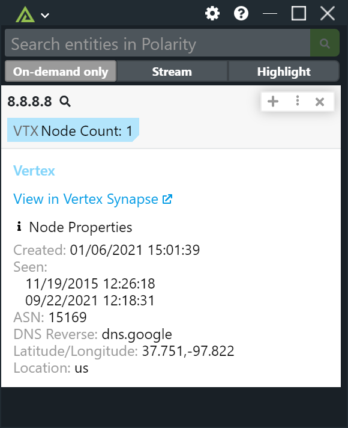

# Polarity Vertex Synapse Integration

Vertex Synapse is a central intelligence system, which serves as a comprehensive solution encompassing the entire intelligence lifecycle from collection to analysis to reporting. The Polarity Vertex Synpase integration allows users to search IOC's by email address, ipv4, ipv6, domains and hashes.

### Vertex URL

The URL of your Vertex Synapse instance

### Vertex Username

Your Vertex Synapse Username

### Vertex Password

The Vertex Synapse Password for the provided Username

## Installation Instructions

Installation instructions for integrations are provided on the [PolarityIO GitHub Page](https://polarityio.github.io/).

## Polarity

Polarity is a memory-augmentation platform that improves and accelerates analyst decision making. For more information about the Polarity platform please see:

https://polarity.io/
